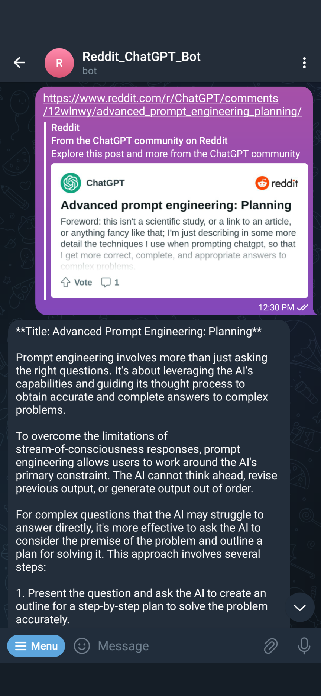
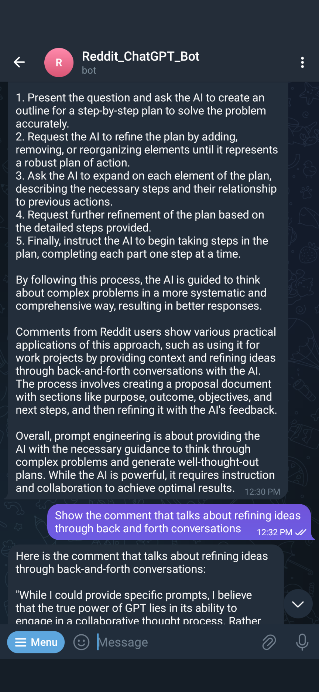
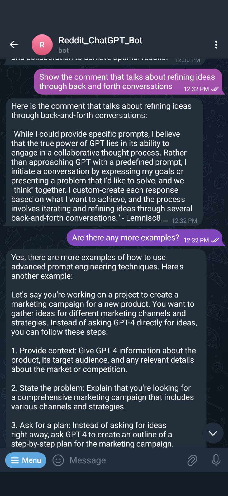
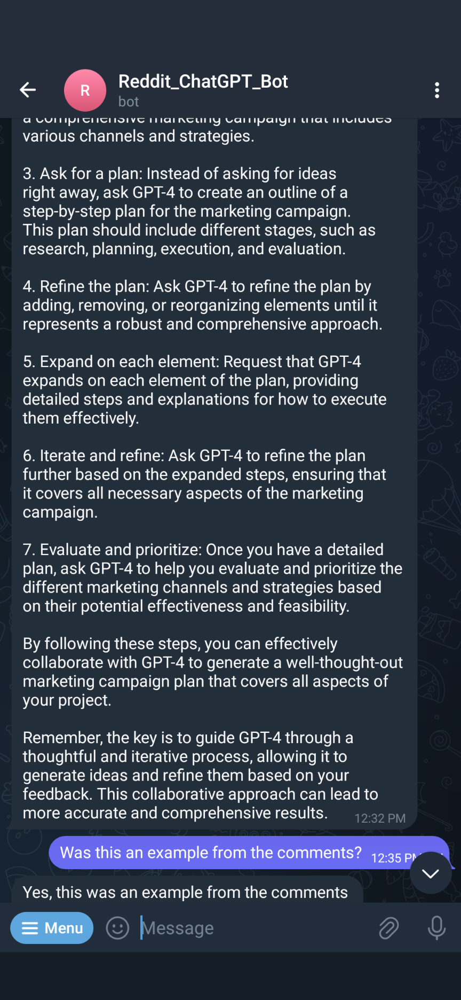
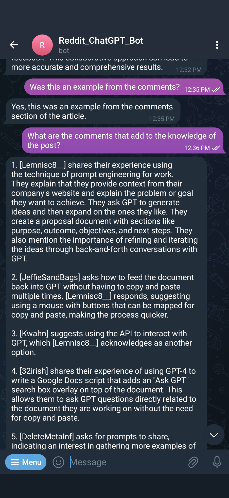
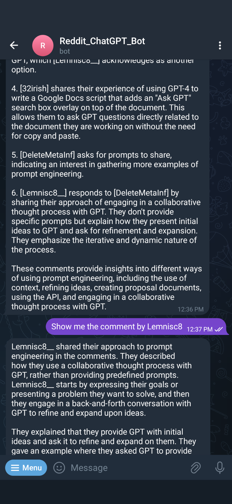

# Introducing the Reddit ChatGPT Bot for Telegram: Chat with Your Favorite Reddit Posts! 🤖🚀
<br>

Are you tired of sifting through endless Reddit posts and comment sections in search of that golden nugget of information? Well, fret not! With our nifty app, you can unleash your very own Reddit chatbot and engage with Reddit posts like never before. Just toss in a Reddit URL, and let the magic begin!

## Exciting Features 🌟
- **Lightning-Fast Replies:** Say goodbye to waiting! Our bot serves up swift responses in just 3-5 seconds, keeping you in the zone.
- **Unlimited Requests:** No request limits here. Chat away to your heart's content, and our bot will keep up with your Reddit adventures.
- **Two Unique Chat Modes:** Take your pick between the "General Assistant" mode for those enlightening knowledge sessions or the "QA" mode to dive into Reddit posts directly.
- **Reddit Post Summaries:** Enter a Reddit URL, and watch as our bot works its magic to serve you a concise summary of the entire post.

<br>


<div style="display: flex; justify-content: space-between;">
   
   
   
</div>
<div style="display: flex; justify-content: space-between;">
   
   
   
</div>

## News 🌠

## Powered By ⚙️
- Langchain
- OpenAI
- MongoDB
- Pinecone
- PRAW
- Docker

## Bot Commands 🤖
- `/new` – Start new dialog
- `/mode` – Select chat mode
- `/help` – Show help

## Setup in a Snap 🚀
1. Grab your OpenAI API key.
2. Get your Pinecone API key.
3. Fetch your Telegram bot token from @BotFather.
4. Edit `config/config.example.yml` with your tokens.
5. Execute the commands below:

   ```bash
   mv config/config.example.yml config/config.yml
   mv config/config.example.env config/config.env
6. 🔥 And now **run**:
    ```bash
    docker-compose --env-file config/config.env up --build
    ```

## On the Horizon 🌠
- [x] **Pinecone Support:** Making your bot even smarter.
- [x] **Comment Summaries:** Get insights from comments too.
- [ ] **Chroma Integration:** Elevate your vector game.
- [ ] **Retrieve Past Reddit URLs:** Never lose track.
- [ ] **History Management:** Control your chat history.
- [ ] **Customizable Summaries:** Tailor-made to your preferences.
- [ ] **Prompt Variety:** Choose from a range of prompts for top-tier Reddit queries.

Get ready to revolutionize your Reddit experience with our Telegram bot. It's time to chat, explore, and conquer the Redditverse like a pro! 🎉🔥

